# NextRole 사용자 가이드

**버전 1.1.0 · 한국어 · 2026-09-27**

NextRole은 현재 경력을 구조화하고, 목표 직무와 추가 역량에 따라 전환 가능성을 비교하는 경력전환 시뮬레이터입니다. “어떤 직업이 맞을까?”를 살펴본 다음, “이 역량을 더하면 어떻게 달라질까?”를 직접 실험할 수 있습니다.

이 가이드의 화면은 실제 서비스를 실행해 촬영한 합성 시연 데이터입니다. 인물·조직·채용·교육 예시는 실제 모집 정보가 아닙니다. 운영 중인 서비스의 메뉴는 관리자 설정과 계정 역할에 따라 달라질 수 있습니다.

[서비스 소개](index.html) · [소개 영상](index.html#video) · [관리자 가이드](admin-guide.html) · [PDF 내려받기](user-guide.pdf) · [Markdown 원문](user-guide.md) · [전체 화면 갤러리](screenshots/index.html)

[TOC]

## 시작하기

### 로그인과 버전 확인

조직에서 안내한 NextRole 주소에 접속합니다. 이메일과 비밀번호를 입력하고 **로그인**을 선택합니다. 관리자가 SSO를 연결했다면 로그인 화면에 Google, LinkedIn, 카카오, 네이버, Keycloak 또는 조직에서 지정한 이름의 버튼이 나타납니다.

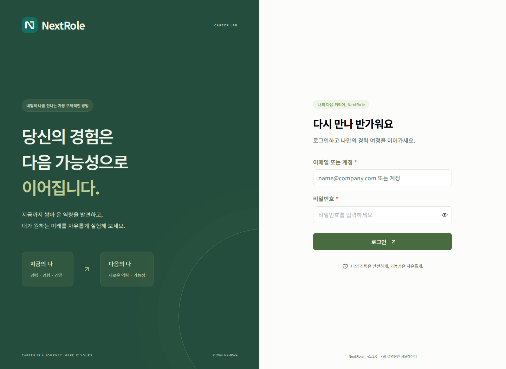

- **계정 만들기**가 보이면 직접 가입할 수 있습니다. 보이지 않으면 관리자에게 계정을 요청합니다.
- 로그인 화면 하단에서 `NextRole v1.1.0`과 같은 서비스 버전을 확인합니다.
- 로그인 후에는 오른쪽 위 프로필 메뉴 → **NextRole 버전 정보**에서 같은 정보를 확인합니다.
- 일반 로그인 비밀번호는 12~72바이트 범위입니다. 한글 등 여러 바이트 문자는 글자 수와 바이트 수가 다릅니다.
- SSO 이메일과 기존 로컬 계정 이메일이 같아도 자동으로 병합하지 않습니다. 중복 안내가 나오면 기존 계정으로 로그인하거나 관리자에게 문의합니다.

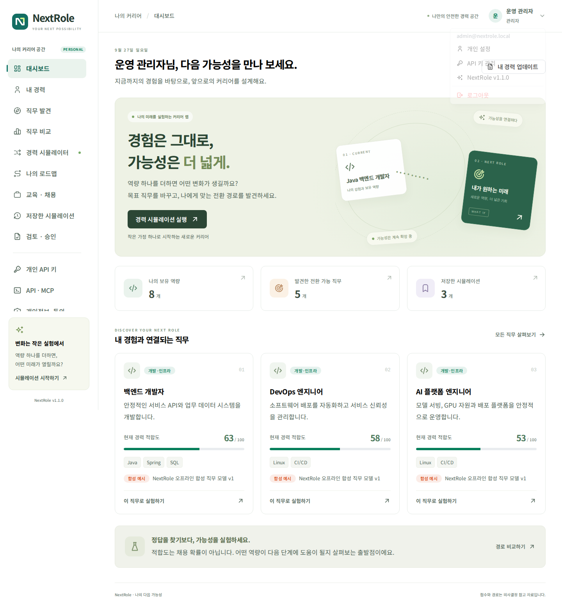

### 화면 구성과 이동

왼쪽은 **나의 커리어 공간** 메뉴, 오른쪽은 현재 작업 화면입니다. 모바일에서는 상단의 메뉴 열기 버튼으로 왼쪽 메뉴를 펼칩니다. URL에 현재 메뉴가 반영되므로 **내 경력**, **직무 비교**, **관리 설정** 등에서 새로고침해도 해당 메뉴로 돌아옵니다. 아직 저장하지 않은 입력은 새로고침하면 사라질 수 있습니다.

| 메뉴 | 주요 작업 |
| --- | --- |
| 대시보드 | 경력 현황과 추천 직무 확인 |
| 내 경력 | 경력 입력, 파일 분석, 역량 확인과 저장 |
| 직무 발견 | 추천 Top 5, 목표 직무 검색 |
| 직무 비교 | 최대 3개 직무의 결과 비교 |
| 경력 시뮬레이터 | 목표·기간·추가 역량에 따른 재계산 |
| 나의 로드맵 | 실행 계획 확인과 완료 표시 |
| 교육 · 채용 | 연동된 교육과정·채용공고 확인 |
| 저장한 시뮬레이션 | 과거 결과 조회·다시 계산·삭제 |
| 개인 API 키 | 발급·권한 수정·회전·폐기 |
| API · MCP | 명세와 클라이언트 연결 예제 |
| 개인 설정 | 계정 표시 이름, 개인 선호, 비밀번호 |
| 개인정보·동의 | 수집 안내 확인·동의·철회와 개인 경력 자료 삭제 |
| 검토 · 승인 | 관리자가 절차를 켰을 때만 표시 |

서비스 관리자에게는 **서비스 관리** 이동 메뉴가 추가됩니다. 관리자 공간은 개인 경력 공간과 분리되어 있습니다.

### 처음 사용하는 순서

1. **개인정보·동의**에서 현재 수집·분석 안내를 읽고 동의한 뒤 **내 경력**에 현재 직무·경력 기간·희망지역·주당 학습시간을 입력합니다.
2. 자유서술 또는 이력서로 역량을 추출하고 수준·신뢰도를 직접 확인합니다.
3. **경력 저장**을 눌러 프로필을 저장합니다.
4. **직무 발견**에서 관심 직무를 고릅니다.
5. **경력 시뮬레이터**에서 추가 역량과 기간을 바꿔 봅니다.
6. 결과를 저장하고 **나의 로드맵**에서 실행 항목을 확인합니다.

## 경력 정보 동의와 삭제

**개인정보·동의**에서 수집 항목, 분석 목적, AI 서버 전송 조건과 삭제 범위를 먼저 읽습니다. 안내 확인 체크박스를 선택하고 **동의하고 경력 서비스 이용**을 누르면 경력 입력·파일 분석·추천·시뮬레이션을 사용할 수 있습니다. 관리자가 안내 또는 버전을 바꾸면 다시 동의해야 합니다. 동의하지 않아도 계정 설정·API 키 관리·허용된 관리자 기능을 이용할 수 있습니다.

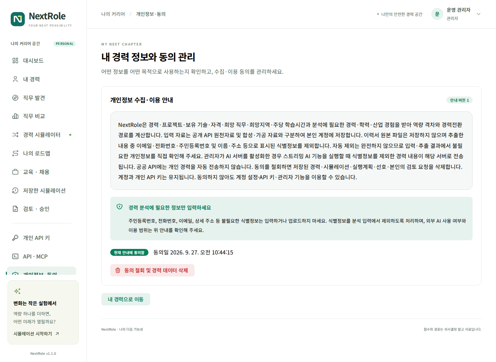

계정의 표시 이름과 경력 분석 자료는 별개입니다. 경력 분석용 프로필에는 이름을 보관하지 않으며, 입력·추출 내용의 이메일·전화번호·주민등록번호와 `이름:`, `주소:` 등으로 표시된 줄을 자동 제외합니다. **자동 제외는 완전한 익명화가 아닙니다.** 문장 속 이름, 상세한 소속·주소, 제3자의 정보 등이 남을 수 있으므로 저장 전에 직접 확인하고 불필요한 내용을 지우세요.

이력서 원본 파일은 저장하지 않습니다. 추출 결과를 저장하면 필요한 경력 자료만 본인 계정에 보관합니다. 고용24 조회에 개인 경력을 자동 전송하지 않습니다. 관리자가 AI를 활성화하고 사용자가 스트리밍 AI 기능을 실행하면 식별정보 제외를 거친 관련 경력 내용이 설정된 AI 서버로 전달됩니다.

**동의 철회 및 경력 데이터 삭제**는 현재 동의 기록과 본인의 경력 프로필·저장한 시뮬레이션·로드맵 완료 기록·직무 선호·본인이 요청한 검토 자료를 삭제합니다. 계정·개인 API 키는 유지되므로 계정 탈퇴나 키 폐기로 해석하지 마세요. 기존 조직 백업과 감사 로그의 운영·보관 범위는 관리자 안내를 확인합니다. 다시 동의해도 삭제한 경력 자료가 자동 복원되지 않습니다.

## 대시보드

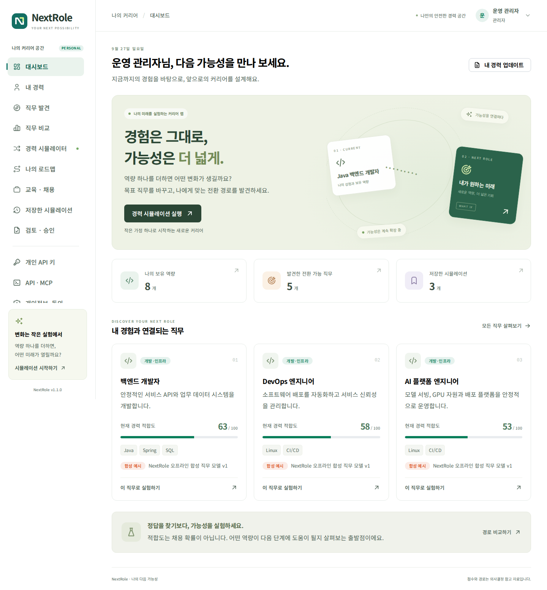

**경력 시뮬레이션 실행**으로 실험을 시작하거나 **내 경력 업데이트**로 프로필을 보완합니다. 추천 직무 카드의 점수는 현재 저장된 경력에서 계산합니다. 아직 경력을 입력하지 않았다면 먼저 프로필을 작성하세요. 빈 경력으로 나온 순위는 개인에게 검증된 추천이 아닙니다.

저장된 경력을 수정한 뒤 새로 계산하면 결과가 바뀔 수 있습니다. 동일한 경력·직무 모델·관리자 가중치·추가 조건에서는 같은 점수를 계산합니다.

## 경력 프로필 작성

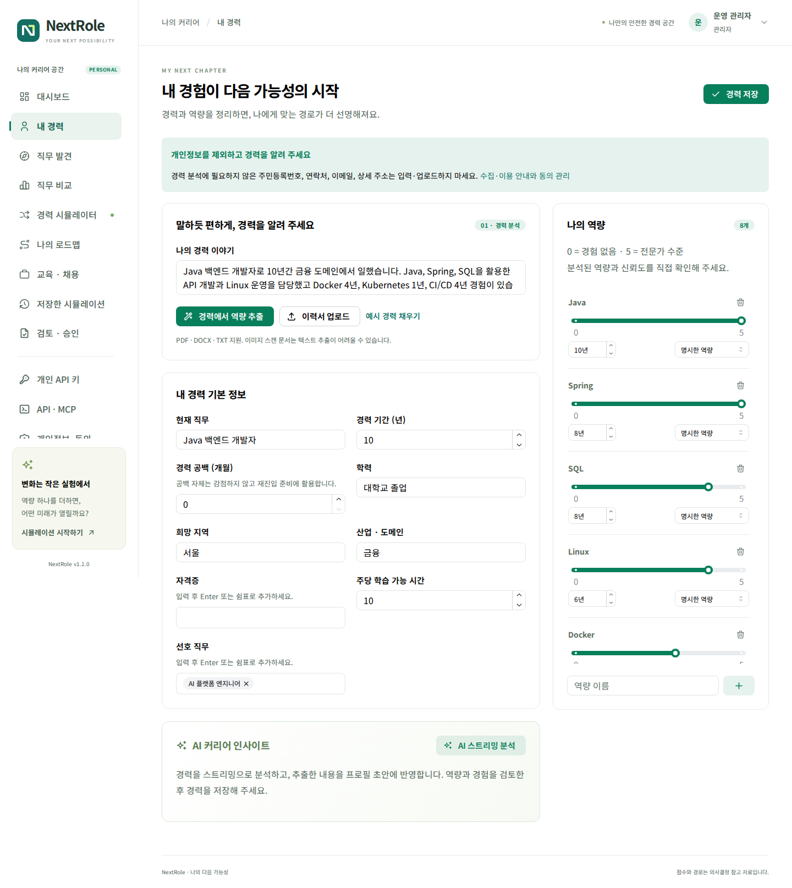

### 기본 정보

| 항목 | 입력 방법과 활용 |
| --- | --- |
| 현재 직무 | 실제 수행한 직무를 구체적으로 입력 |
| 경력 기간 | 총 경력 연수. 직무 참고 경력과 비교 |
| 경력 공백 (개월) | 0~600개월. 공백 자체로 감점하지 않고 재진입 준비에 활용 |
| 학력 | 입력한 학력과 목표 직무의 참고 학력을 비교 |
| 희망 지역 | 공고 조회의 지역 필터와 개인 선호에 활용 |
| 산업 · 도메인 | 금융, IT, 제조, 서비스 등 실제 산업 경험 |
| 자격증 | 쉼표로 구분해 보관. 검증 매핑 없는 자격증은 점수를 자동 가산하지 않음 |
| 주당 학습 가능 시간 | 참고 학습기간 계산에 사용. 점수 자체를 올리지는 않음 |
| 선호 직무 | 직무 이름, ID 또는 분류와 일치하면 선호 요소에 반영 |

교육·경력·지역이 비어 있으면 해당 요소에서 근거를 확인할 수 없어 낮은 점수가 나올 수 있습니다. 불필요하게 유리한 값을 넣기보다 실제 상태를 기록해야 여러 경로를 유용하게 비교할 수 있습니다.

경력 공백을 입력하면 최근 도구·업무 방식 확인과 작은 복귀 프로젝트를 로드맵 첫 단계에 추가합니다. 공백 기간을 이유로 적합도를 깎거나 다시 취업할 가능성을 낮다고 판단하지 않습니다.

### 자유서술에서 역량 추출

**나의 경력 이야기**에 업무, 기술, 사용 기간을 적은 뒤 **경력에서 역량 추출**을 누릅니다.

```text
Java 백엔드 개발 경력 10년입니다.
Java 10년, Spring 8년, Docker 4년, Kubernetes 1년 경험이 있습니다.
금융 도메인에서 REST API와 CI/CD를 운영했습니다.
Python은 기초 수준입니다. 희망 지역은 서울입니다.
```

오프라인 파서는 알려진 기술명·별칭과 명시된 기간을 구조화합니다. `K8s`와 `쿠버네티스`는 `Kubernetes`로 정규화합니다. 모든 전문용어와 문장 의미를 이해하는 것은 아니므로 추출 결과를 확인하고 빠진 역량을 추가하세요. 앞으로 배우고 싶은 기술을 이미 가진 기술처럼 적지 않는 것이 좋습니다.

자동 추출 후 **경력 저장**을 눌러야 저장된 프로필에 반영됩니다. 예시 채우기는 시연을 위한 입력이며 본인의 실제 경력과 구분하세요.

### PDF·DOCX·TXT 이력서 업로드

**이력서 업로드**에서 파일을 선택합니다.

- 지원 형식: `.pdf`, `.docx`, UTF-8 `.txt`
- 최대 파일 크기: 10 MiB
- PDF: 텍스트가 포함된 PDF를 지원하며 최대 앞 100페이지를 처리합니다.
- 스캔 이미지 PDF: OCR 결과가 없으면 텍스트 추출이 불가능합니다. OCR 처리한 PDF 또는 TXT로 변환합니다.
- DOCX: 본문 텍스트를 추출합니다. 이미지에만 있는 글자와 복잡한 표의 의미는 자동 해석하지 않습니다.
- 암호화·손상 파일 또는 추출 텍스트가 지나치게 큰 파일은 오류가 표시됩니다.

파일은 현재 안내에 동의한 뒤 로컬 서버에서 분석합니다. 원본 파일은 저장하지 않으며 추출 결과에서 식별정보를 확인하세요. 이력서 업로드 자체가 외부 AI 전송을 의미하지 않습니다. 별도 AI 설명 기능을 사용할 때는 조직이 설정한 AI 서버로 관련 입력이 전송될 수 있습니다.

### 역량 수준과 신뢰도

| 수준 | 기록 기준 예시 |
| --- | --- |
| 0 | 보유 근거 없음 |
| 1 | 입문·기본 개념 이해 |
| 2 | 기초 과제를 도움을 받아 수행 |
| 3 | 일반적인 실무를 독립 수행 |
| 4 | 복잡한 실무와 운영 문제 해결 |
| 5 | 고급 설계·최적화·지도 가능 |

이 기준은 NextRole의 내부 비교 척도입니다. 특정 자격시험 등급이나 NCS 공식 수준과 동일하지 않습니다.

| 신뢰도 | 의미 | 점수 반영 |
| --- | --- | --- |
| 명시 `explicit` | 사용자가 보유 사실을 입력하거나 확인 | 반영 |
| 추론 `inferred` | 설명에서 추정한 역량 | 확인 전 제외 |
| 검증 필요 `review` | 자동 추출 결과를 추가 확인해야 함 | 확인 전 제외 |

프로젝트 리딩을 했다는 문장에서 **프로젝트 관리**를 추론할 수 있지만, 해당 역량을 충분히 보유했다고 확정하지 않습니다. 실제 경험을 확인한 뒤 수준과 신뢰도를 수정해 저장하세요. 역량 추가 버튼으로 새 역량을 입력하고 불필요한 항목은 삭제할 수 있습니다.

## 직무 발견과 비교

### 직무 발견

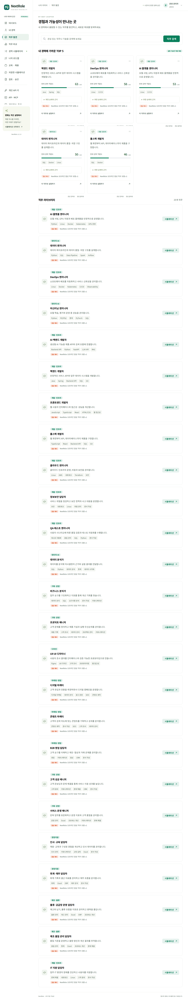

추천 Top 5는 저장된 프로필과 직무 모델의 비교 결과입니다. 기본 제공 직무 모델에는 개발·AI·데이터·기획·디자인·마케팅·영업·인사·회계·물류·품질 등의 합성 예시가 포함됩니다. 관리자가 사내 직무를 가져오거나 공공 원천을 바탕으로 검토한 매핑을 게시하면 검색 대상에 추가됩니다. 합성 모드를 끄고 게시된 직무도 없으면 목록이 비어 있는 것이 정상입니다. 원천만 가져왔거나 매핑을 초안으로 저장한 상태에서는 목표 직무로 사용할 수 없습니다.

**목표 직무 검색**에서 직무명, 기술 또는 분류를 검색하고 **시뮬레이션**을 선택합니다. 관심·비선호 피드백은 이후 추천 순위와 표시 후보에 영향을 줍니다. 추천 순위에는 선호 피드백과 관련 실제 공고 수의 제한된 보정이 적용될 수 있지만, 화면의 여섯 요소 적합도 점수 자체는 그대로입니다. 비선호 직무는 추천 목록에서 제외합니다. 관련 실제 공고가 없으면 채용 수요 보정을 만들지 않습니다.

### 최대 세 개 직무 비교

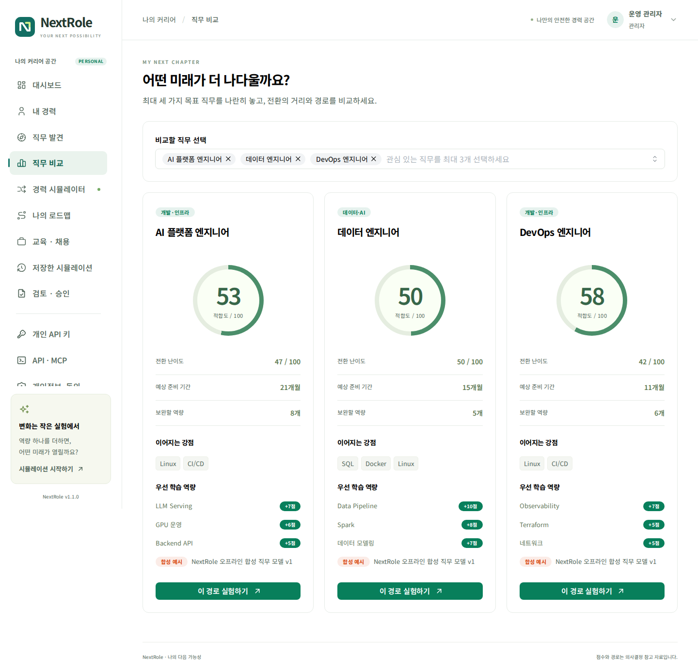

**비교할 직무 선택**에서 최대 3개를 선택합니다. 적합도, 예상 학습기간, 강점과 우선 학습 역량을 나란히 봅니다. 예를 들어 AI 플랫폼 엔지니어, DevOps 엔지니어, 데이터 엔지니어를 비교하면 기존 경험을 얼마나 활용하는지 확인할 수 있습니다.

비교 결과에서 **이 경로 실험하기**를 누르면 해당 직무의 시뮬레이터로 이동합니다. 점수만으로 결정하기보다 수행 업무, 실제 공고 요건, 흥미와 생활 조건을 함께 고려하세요.

## 적합도와 역량 격차 읽기

기본 가중치는 다음과 같으며 관리자가 변경할 수 있습니다.

| 요소 | 기본 비중 | 계산 근거 |
| --- | ---: | --- |
| 기술역량 | 40% | 확인된 현재 수준 ÷ 요구 수준을 중요도로 가중 평균 |
| 전이 가능 역량 | 20% | 정확히 일치하는 기술과 로컬 의미 특징 벡터 유사도 |
| 경력 | 15% | 총 경력과 직무 참고 경력의 비율, 상한 적용 |
| 산업경험 | 10% | 산업 일치 또는 정의된 인접 산업 |
| 교육·자격 | 5% | 학력 요건 비교. 자격증은 검증 매핑 전 자동 가산 없음 |
| 개인 선호 | 10% | 선호 직무·분류와 지역의 명시적 일치 |

**역량 격차 = max(요구 수준 − 확인된 현재 수준, 0)**입니다. 다른 기술과 개념이 비슷해도 직접적인 부족 수준을 채웠다고 간주하지 않습니다. 전이 가능성은 별도 요소이며, 다른 기술의 유사도 기여는 보수적으로 제한합니다.

난이도는 `100 − 적합도`입니다. 점수가 80이라고 취업 확률이 80%라는 뜻은 아닙니다. 총 경력이 길어도 새로운 목표에 필요한 기술이 없으면 기술 점수는 낮을 수 있습니다. 자동 추론 상태인 역량은 점수에서 제외되므로 확인이 필요합니다.

### 공공 원문과 내부 요구 수준 구분

출처가 **가공 데이터**인 직무는 관리자가 원천 직업·NCS 자료를 확인하고 게시한 매핑입니다. 표시된 0~5 요구 수준, 가중치와 별칭은 서비스 내부 설정이며 고용24·NCS의 공식 평가값이 아닙니다. 별칭이 같은 내부 역량으로 연결된다는 사실이 국가 자격이나 NCS 능력단위 동등성을 보증하지 않습니다.

공공 원천에 요구 경력·학력 기준이 없으면 해당 요소를 충족한 것으로 추정하지 않으며 0점과 그 이유를 표시합니다. 설정하지 않은 배점을 다른 요소에 재분배하지 않으므로 서로 다른 데이터 완성도의 직무를 비교할 때 점수 근거를 함께 봅니다. 원문이 바뀌거나 삭제되면 관리자가 재검토·게시할 때까지 해당 직무가 목록에서 제외될 수 있습니다.

## What-if 시뮬레이션

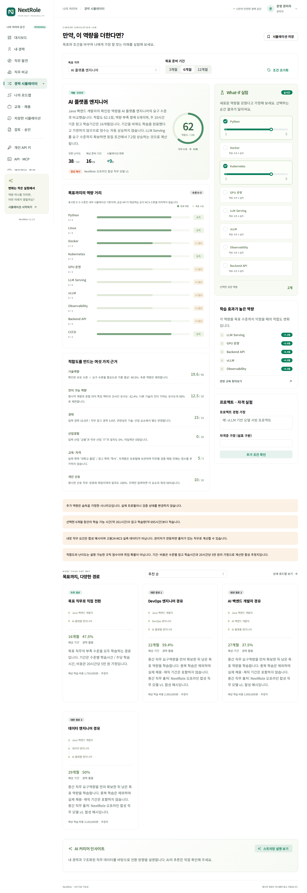

### 목표와 기간 선택

1. **목표 직무**에서 실험할 직무를 선택합니다.
2. **3개월 / 6개월 / 12개월** 중 계획 범위를 선택합니다.
3. 현재 적합도, 부족 역량과 근거를 확인합니다.
4. 학습했다고 가정할 역량을 선택하거나 수준을 조정합니다.
5. 조건 변경에 따른 예상 적합도와 변화폭을 확인합니다.

기간을 늘리는 것만으로 역량이 생기지는 않으므로 점수는 자동 상승하지 않습니다. 기간은 실행계획과 학습량 안내에 사용합니다. 추가 역량은 **가정**이며 원래 경력 프로필을 수정하지 않습니다.

### 학습 효과와 우선순위

**학습 효과가 높은 역량**은 각 부족 역량을 목표 수준까지 채웠을 때 같은 조건에서 얼마나 점수가 증가하는지 보여 줍니다. 개별 상승폭을 단순히 더하면 조합 결과와 다를 수 있으므로, 실제 선택 조합은 시뮬레이터로 다시 계산하세요.

학습계획의 우선순위는 점수 상승과 참고 학습시간을 함께 고려합니다. 이 학습 효과는 금전적인 투자 수익을 예측하는 금융 지표가 아닙니다.

### 프로젝트·자격증 가정

**프로젝트 경험 가정**에 수행했다고 가정할 내용을 입력하고 **추가 조건 확인**으로 반영합니다. 문장에서 인식한 역량은 보수적인 수준의 가정으로 계산됩니다. 실제 수행 증명이나 검증을 대신하지 않습니다.

**자격증 가정**은 계획 비교를 위한 입력입니다. 현재 버전에서는 특정 자격증과 직무 요구사항의 검증 매핑이 없으므로 자격증 이름만 추가했다고 적합도를 올리지 않습니다.

### 직접 전환과 중간 직무

**목표까지, 다양한 경로**에서 현재 직무 → 목표 직무로 직접 가는 경로와 중간 직무를 거치는 경로를 비교합니다. 중간 직무 요구역량을 먼저 확보했다고 가정한 뒤 남은 목표 역량을 학습하므로 중복 학습을 제외합니다.

**추천 순 / 기간 짧은 순 / 추가 역량 적은 순 / 경력 활용 높은 순**으로 경로를 정렬할 수 있습니다. “추가 역량 적은 순”은 항목 수, “경력 활용 높은 순”은 해당 단계의 요구 수준 대비 이미 보유한 수준을 비교합니다. 목록에 제시된 경로 안에서의 비교이며 전체 노동시장의 모든 경로를 최적화한 결과는 아닙니다.

표시 기간은 기술 수준별 학습시간과 주당 학습시간으로 계산한 참고치입니다. 실제 구직기간·재직기간·채용 성공까지의 기간을 포함하지 않습니다. 비용은 20시간당 5만 원을 가정한 합성 추정치이며 실제 교육과정 가격이나 정부지원금이 아닙니다. 화면에 표시된 출처를 함께 확인하세요.

### 결과 저장

**시뮬레이션 저장**으로 현재 결과를 기록합니다. 저장한 결과는 그 당시 프로필·직무·가중치의 계산값이며, 이후 프로필을 바꿔도 자동으로 덮어쓰지 않습니다.

## 로드맵과 실행 기록

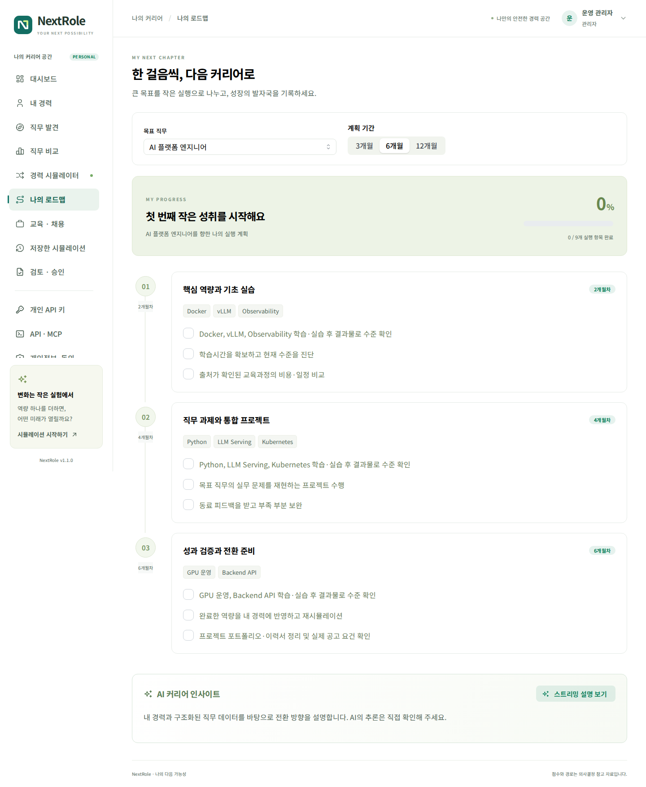

목표 직무와 기간에 따른 단계별 실행 항목을 확인합니다. 기초 실습 → 직무 프로젝트 → 성과 검증과 전환 준비 흐름으로 계획이 구성됩니다. 완료 체크는 계정별로 저장됩니다.

- 완료 체크는 **실행 기록**입니다. 보유 역량 수준을 자동으로 올리지 않습니다.
- 실제로 역량을 습득했다면 **내 경력**에 수준과 근거를 반영하고 저장합니다.
- 같은 목표를 다시 계산해 격차가 얼마나 줄었는지 확인합니다.
- 주당 학습시간 대비 선택 기간의 학습량이 많으면 경고를 참고해 기간이나 우선순위를 조정합니다.

## 교육과 채용정보

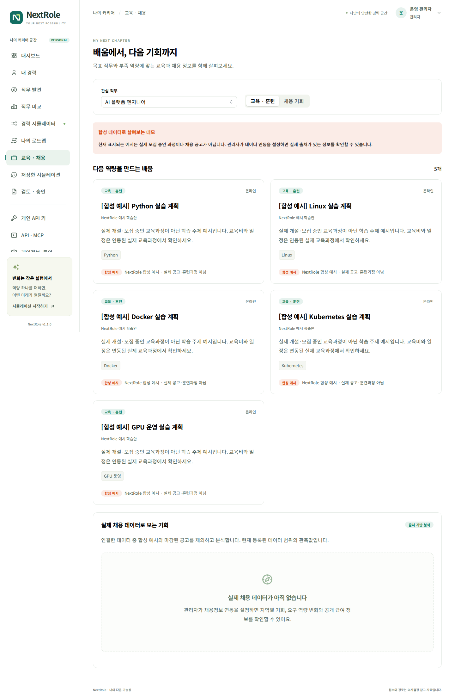

목표 직무를 선택하고 교육·훈련 또는 채용 탭을 봅니다. 채용은 관리자가 검토한 직종코드, 정확한 직무명 또는 출처가 확인된 요구역량으로 관련성을 판단합니다. 희망지역 조건도 적용됩니다. 직업상세의 직업코드와 채용 직종코드를 임의로 같은 코드로 보지 않습니다.

고용24 훈련은 게시된 매핑의 NCS 코드가 원천 과정의 NCS 코드와 일치할 때 연결합니다. 제목만 비슷한 과정을 부족 역량에 맞는 과정으로 단정하지 않습니다. 과정 ID와 회차, 훈련 시작일·종료일을 함께 확인하세요. **수강비·실제 훈련비 표시는 원문 참고값이며 개인별 확정 본인부담금이 아닙니다.** 지원 자격·지원금·추가 비용은 해당 훈련기관 원문에서 확인합니다.

**합성 예시** 표시는 실제 개설 교육이나 실제 채용이 아닙니다. 실제 공고가 연결되어 있으면 기관·지역·설명·원문 링크와 출처가 표시됩니다. **원문에서 자세히 보기**로 운영기관의 정확한 일정, 자격, 비용과 지원 방법을 확인하세요.

**연결된 채용 정보에서 자주 찾는 역량**은 가져온 실제 공고 중 각 역량을 포함한 공고 수입니다. 전체 노동시장의 수요나 실시간 트렌드가 아니며 합성 예시는 집계에서 제외합니다. 고용24 채용 목록 API에는 요구기술 목록이 없으므로 공고 제목에서 기술을 추론해 채우지 않습니다. 해당 API만 연결했다면 실제 공고가 있어도 역량 빈도·추세는 비어 있을 수 있습니다. 데이터가 비어 있으면 관리자의 연동 여부·선택 필드·검토된 코드 매핑·마지막 수집 상태를 확인해야 합니다.

### 실제 채용 데이터로 보는 기회

교육·채용 페이지 아래의 **실제 채용 데이터로 보는 기회** 패널에서 지역별 채용 기회, 요구 역량의 변화와 공개된 급여 정보를 확인합니다. 실제로 가져온 공고만 집계하며 합성 예시는 제외합니다.

집계는 유효한 마감일 또는 상시채용 표시가 있는 실제 공고를 대상으로 합니다. 마감일을 확인할 수 없는 공고는 수요 집계에서 제외되므로 일반 공고 목록의 개수와 다를 수 있습니다. 동일 원문 URL 중복은 제거하며, 여러 지역을 모집한 공고는 각 지역에 포함될 수 있습니다.

지역별 건수는 수집 범위 안의 분포입니다. 다른 날짜의 이전 관측이 없으면 역량의 증가·감소 추세를 만들어 표시하지 않습니다. 변화값은 백분율이 아니라 해당 역량을 요구하는 공고 수의 차이입니다. 수집 범위 변경과 공고 만료도 영향을 줍니다. 급여는 최대 20개의 원문 표기를 참고하며, 서로 다른 연봉·월급·시급을 임의로 평균내지 않습니다. 표본과 원문 출처를 함께 확인하세요.

### 출처 표시 읽기

| 구분 | 의미 |
| --- | --- |
| 공공 API 원천 `public_api` | 제공기관·공식 API 종류·원천 ID·수집 시각·선택 필드를 보존한 자료 |
| 이용자 입력 `user_input` | 본인이 입력하고 확인한 경력 자료 |
| 합성 `synthetic` | NextRole 시연용 직무·공고·훈련. 실제 모집이나 개인 정보가 아님 |
| 가공 `derived` | 원천을 참조해 관리자가 검토·게시한 내부 직무·역량 모델 |
| 외부 `external` | 별도로 반입한 사내·외부 자료. 출처와 검증 범위를 확인 |

기본 화면에 고용24 실시간 데이터가 포함되어 있다는 뜻은 아닙니다. 실제 API 이용은 관리자의 승인 인증키와 네트워크 연결이 필요합니다. 서비스 개발 검증에는 모의 응답을 사용했으며 실제 승인 인증키로 조회한 결과와 구분합니다.

## 저장한 시뮬레이션

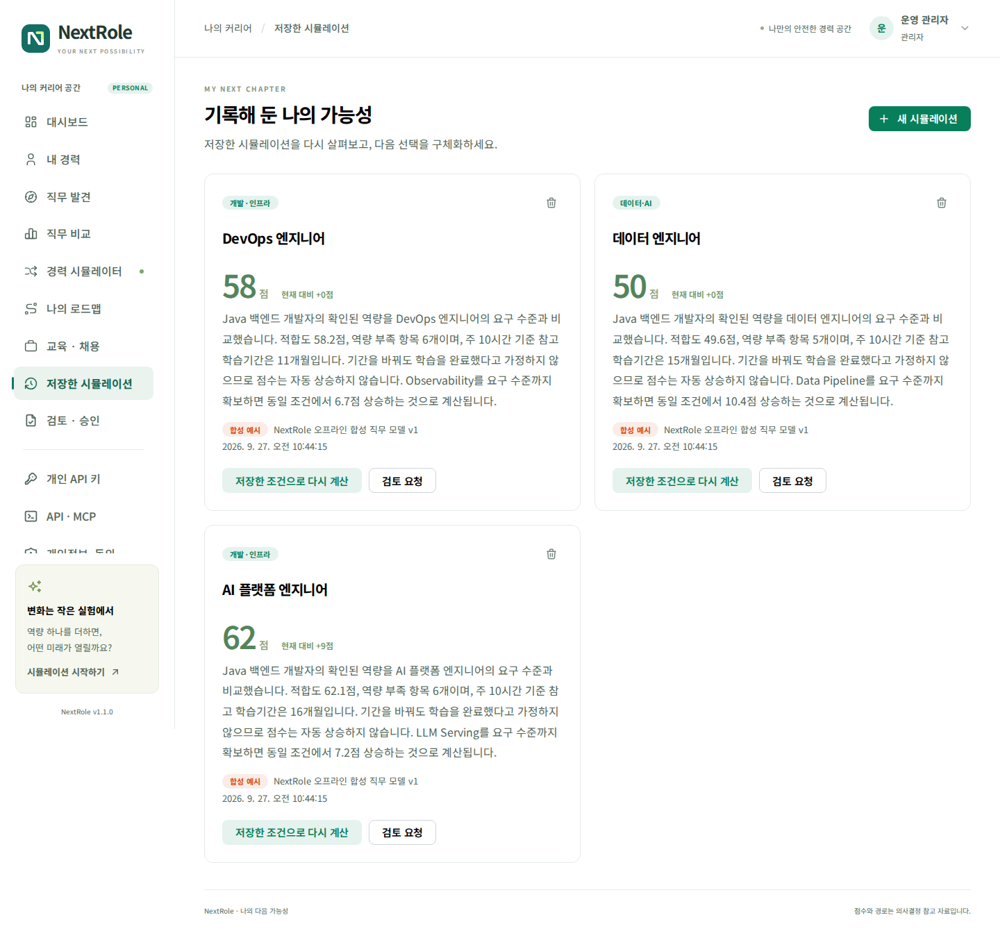

과거 결과를 열어 목표와 점수를 확인합니다. **현재 프로필로 다시 계산**을 선택하면 최신 프로필·모델로 새로운 계산을 시작합니다. 기존 기록을 없애려면 **삭제**를 선택합니다. 삭제 전 필요한 결과를 보관하세요.

관리자가 검토 절차를 켰을 때만 **검토 요청** 버튼이 나타납니다.

## AI 스트리밍 설명

경력 분석·시뮬레이션·계획의 설명 영역에서 **스트리밍 설명 보기**를 선택합니다. 생성되는 문장이 순서대로 표시되며 **생성 중지**로 요청을 중단할 수 있습니다.

AI가 비활성화되어 있으면 오프라인 규칙에 따른 설명을 제공합니다. AI가 활성화되어 있으면 관리자가 설정한 OpenAI 호환 서버를 사용합니다. 외부 AI 연결 여부는 조직의 운영 정책을 따릅니다.

AI 설명을 확인할 때에는 구조화된 점수·역량 격차·출처를 우선합니다. 설명이 입력 경력이나 계산값과 맞지 않으면 해당 내용을 사실로 취급하지 말고 프로필과 연결 상태를 점검하세요. AI 연결이 실패해도 이미 계산된 적합도와 경로의 근거는 따로 확인할 수 있습니다.

## 개인 API 키 관리

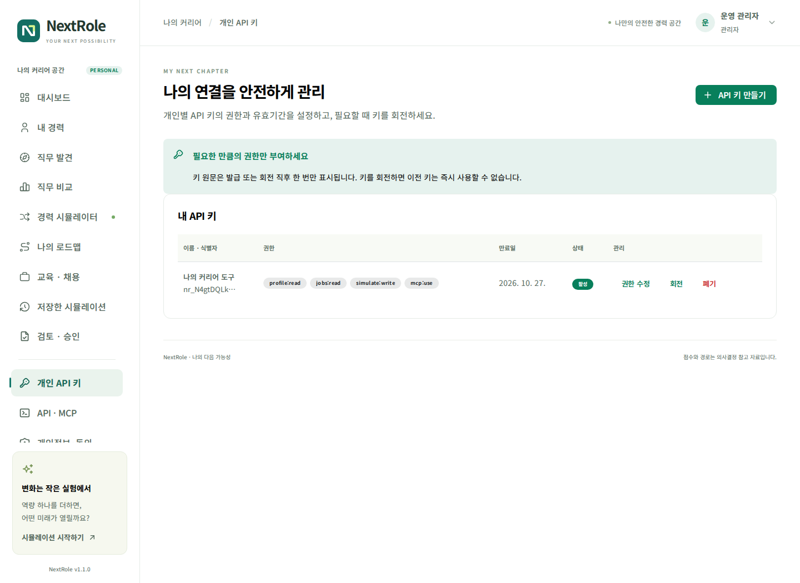

### 발급과 권한 선택

**API 키 만들기**에서 사용 목적을 알 수 있는 이름, 필요한 권한, 유효기간을 입력합니다. 관리자가 허용한 범위 안에서만 선택할 수 있습니다.

| 권한 | 허용 작업 |
| --- | --- |
| `profile:read` | 본인의 경력·추천·저장 결과·로드맵 조회 |
| `profile:write` | 본인의 경력 수정·파싱·업로드·피드백·로드맵 저장 |
| `jobs:read` | 직무·교육·채용 조회 |
| `simulate:write` | 시뮬레이션 계산·저장·삭제 |
| `ai:use` | AI 스트리밍 호출 |
| `mcp:use` | MCP 엔드포인트 접근. 각 도구 작업 권한도 별도로 필요 |

새 키 원문은 **발급·회전 직후 한 번만** 표시됩니다. 사용하는 도구의 비밀 저장소에 보관하세요. 키가 없는 화면을 다시 열어도 원문을 복구할 수 없습니다.

### 수정·회전·폐기

- **권한 수정**: 현재 키의 이름·범위를 바꿉니다. 축소된 권한은 다음 요청부터 적용됩니다.
- **회전**: 새 키를 발급하고 기존 원문을 즉시 무효화합니다. 연결된 도구에 새 키를 반영해야 합니다. 기존 만료일은 유지됩니다.
- **폐기**: 해당 키를 더 이상 사용할 수 없게 합니다. 다시 사용하려면 새 키를 발급합니다.
- 관리자 정책에서 어떤 범위가 제거되면 그 범위를 가진 기존 키도 해당 작업을 할 수 없습니다.

개인 API 키로 관리자 설정, 다른 사람의 경력, 키 발급·권한 관리에 접근할 수 없습니다. 키 관리 화면은 로그인한 사용자 세션으로 사용합니다.

## REST API와 MCP


**API · MCP** 화면에서 현재 서비스의 명세와 연결 예제를 확인합니다. API 기본 경로는 `/api/v1`, MCP 경로는 `/mcp`입니다. 원격 MCP의 HTTP와 Bearer 인증을 지원하는 클라이언트를 사용합니다.

다음 예시는 키를 셸 입력으로 받아 프로필을 조회합니다. `NEXTROLE_URL`과 `NEXTROLE_API_KEY`는 명령 예제의 클라이언트 변수이며 서버 배포 환경변수가 아닙니다.

```bash
NEXTROLE_URL=https://nextrole.example.com
read -rsp '개인 API 키: ' NEXTROLE_API_KEY
printf '\n'
curl --fail --silent --show-error \
  -H "Authorization: Bearer ${NEXTROLE_API_KEY}" \
  "${NEXTROLE_URL}/api/v1/profile"
```

REST에서 `GET /api/v1/privacy`(`profile:read`)로 현재 안내·버전을 조회하고, 내용을 확인한 본인이 `POST /api/v1/privacy/consent`(`profile:write`)에 `{"version":"현재 버전","accepted":true}`를 보내 동의할 수 있습니다. `DELETE /api/v1/privacy/consent`는 동의 철회와 경력 자료 삭제이므로 자동 재시도 작업으로 넣지 마세요. 동의 안내가 바뀌면 재동의가 필요합니다. MCP는 동의를 대신하는 도구를 제공하지 않습니다. `career_simulate`·`career_opportunities`는 웹 또는 REST에서 확인한 현재 동의가 필요하며, `career_profile`·`job_search`는 별도 조회 권한에 따릅니다.

MCP의 `initialize` → `tools/list` → `tools/call` 순서로 도구를 사용합니다. `career_profile`, `job_search`, `career_simulate`, `career_opportunities`가 제공됩니다. 도구 목록과 호출은 보유 키의 허용 권한에 맞게 제한됩니다. 상세 요청 형식은 **OpenAPI 명세 보기**와 MCP의 도구 스키마에서 확인합니다.

## 개인 설정과 비밀번호

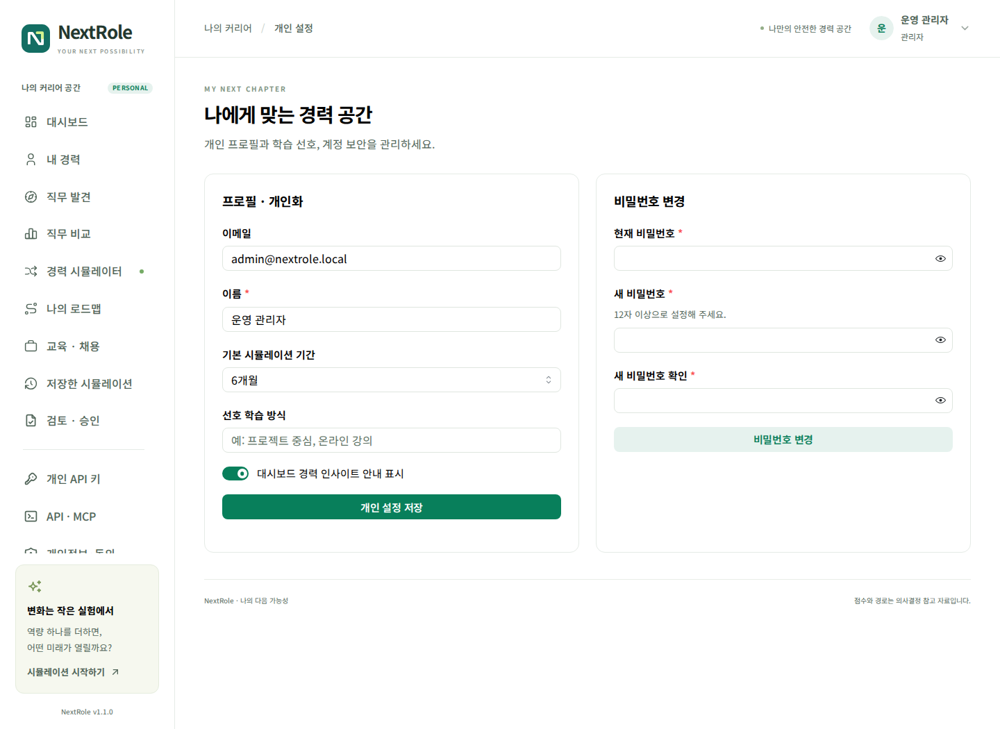

표시 이름, 기본 시뮬레이션 기간과 개인 선호를 변경한 뒤 **개인 설정 저장**을 누릅니다. 화면의 계정 이메일은 식별자로 사용되며 개인 설정에서 임의로 바꾸지 않습니다.

비밀번호를 바꾸려면 현재 비밀번호, 새 비밀번호와 확인값을 입력합니다. SSO만으로 가입한 계정의 비밀번호 설정은 관리자에게 문의하세요. 프로필 메뉴의 **로그아웃**은 NextRole 세션을 종료합니다. SSO 공급자 자체의 로그인 세션까지 자동으로 종료하는 기능과는 다릅니다.

## 선택적 검토·승인


관리자가 프로세스를 **사용**으로 설정한 경우에만 이 메뉴가 보입니다. 설정하지 않았다면 검토·승인·반려 없이 시뮬레이션을 사용할 수 있습니다.

1. 결과를 **시뮬레이션 저장**으로 저장합니다.
2. **저장한 시뮬레이션 → 검토 요청**에서 검토 메모를 작성합니다.
3. **검토 · 승인**에서 요청 상태를 확인합니다.
4. 검토자 또는 관리자는 요청 내용과 의견을 확인하고 **승인** 또는 **반려**합니다.
5. **요청한 시뮬레이션 상세**를 펼쳐 당시 점수·역량 격차·추가 조건과 실행계획을 확인합니다.
6. 본인이 만든 요청은 본인이 승인할 수 없습니다.

현재 절차는 단일 단계 검토입니다. 별도의 팀 조직도, 특정 팀장 자동 배정 또는 다단계 결재를 가정하지 마세요. 조직은 검토자 역할을 지정해 운영합니다. 승인 여부가 취업 성공을 보장하거나 자동 채용 지원을 수행하지 않습니다.

## 문제 해결

| 상황 | 확인할 내용 |
| --- | --- |
| 로그인이 반복해서 실패 | 이메일·비밀번호, 계정 비활성 여부, 잠시 후 재시도 |
| SSO 버튼이 없음 | 관리자의 공급자 활성 여부 확인 |
| SSO가 중복 이메일 안내 | 기존 로컬 계정으로 로그인. 계정 자동 병합은 하지 않음 |
| 추출 결과가 기대와 다름 | 기술명과 경험 기간을 분리 입력하고 직접 편집 |
| PDF에서 글자가 안 나옴 | 스캔·암호화 여부 확인, OCR 후 TXT/PDF 재업로드 |
| 점수가 너무 낮음 | 경력 저장 여부, 미입력 기본정보, 추론·검증필요 상태 확인 |
| 기간을 늘려도 점수가 같음 | 정상. 학습 기간 선택만으로 보유 역량을 늘리지 않음 |
| 교육·채용이 합성 예시만 표시 | 실제 데이터 연동 여부를 관리자에게 확인 |
| AI 설명이 중단 | 생성 중지 여부, AI 서버 접근과 모델 제한 확인 |
| API가 401 | 키 만료·회전·폐기 또는 세션 만료 확인 |
| API가 403 | 개인 키 범위와 관리자 허용 정책 확인 |
| 검토 메뉴가 없음 | 관리자가 프로세스를 끈 상태일 수 있음 |
| 새로고침 후 내용이 사라짐 | 메뉴는 유지되지만 저장 전 폼은 유지되지 않을 수 있음 |

장애 문의 시 **서비스 버전, 발생 메뉴, 수행한 작업, 발생 시각, 화면 오류 문구**를 전달하면 원인 파악에 도움이 됩니다. 비밀번호와 API 키 원문은 전달하지 마세요.

동의 안내가 나타나거나 API가 동의 필요 오류를 반환하면 **개인정보·동의**에서 최신 안내를 읽습니다. 철회 후에는 경력 데이터를 다시 입력해야 합니다. 목표 직무가 사라진 경우 합성 모드 설정이나 원천 변경에 따른 매핑 재검토 여부를 관리자에게 확인합니다.

## 화면별 빠른 참조

| 원하는 작업 | 이동 경로 |
| --- | --- |
| 경력 수정 | 내 경력 → 경력 저장 |
| 목표 직무 변경 | 경력 시뮬레이터 → 목표 직무 |
| 역량 추가 후 계산 | 경력 시뮬레이터 → 추가 역량 |
| 세 직무 비교 | 직무 비교 → 비교할 직무 선택 |
| 실행 체크 | 나의 로드맵 → 완료 체크 |
| 과거 결과 보기 | 저장한 시뮬레이션 |
| 개인 키 회전 | 개인 API 키 → 회전 |
| 버전 확인 | 프로필 메뉴 → NextRole 버전 정보 |

문서와 화면의 데이터는 설명용입니다. 정확한 직무 요건과 교육·채용 조건은 승인된 원천 데이터에서 확인하세요.
